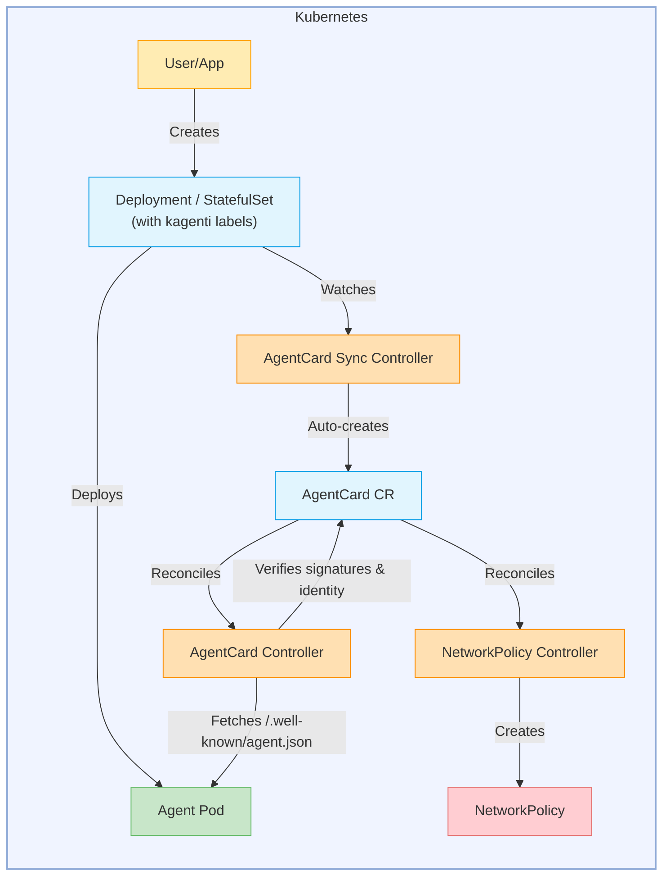

# Kagenti Operator

[](LICENSE)


**Kagenti Operator** is a Kubernetes operator that automates the deployment, discovery, and security of AI agents in Kubernetes clusters.

## Overview

The Kagenti Operator manages the following Custom Resource Definitions (CRDs):

| Resource | Purpose |
|----------|---------|
| **[AgentCard](./kagenti-operator/docs/api-reference.md#agentcard)** | Discovers, indexes, and verifies agent metadata for Kubernetes-native agent discovery |

Agents are deployed as standard Kubernetes **Deployments** or **StatefulSets** with the `kagenti.io/type: agent` label. The operator automatically discovers labeled workloads and creates AgentCard resources for them.

### Key Features

- **Agent Deployment** — Deploy agents using standard Kubernetes Deployments or StatefulSets with the `kagenti.io/type: agent` label
- **Dynamic Agent Discovery** — Automatic indexing of agent metadata via the A2A protocol
- **Signature Verification** — JWS-based cryptographic verification of agent cards (RSA, ECDSA)
- **Identity Binding** — SPIFFE-based workload identity binding with allowlist enforcement
- **Network Policy Enforcement** — Automatic NetworkPolicy creation based on signature verification status
- **Flexible Configuration** — Complete control over pod specifications, service ports, and environment variables
- **Multi-Framework Support** — Works with LangGraph, CrewAI, AG2, and any A2A-compatible framework

## Architecture



The operator runs three controllers:

| Controller | Purpose |
|------------|---------|
| **AgentCard Sync Controller** | Watches Deployments/StatefulSets with agent labels and auto-creates AgentCard resources |
| **AgentCard Controller** | Fetches agent card data from running agents, verifies signatures, evaluates identity binding |
| **NetworkPolicy Controller** | Creates permissive or restrictive NetworkPolicies based on signature verification status |

## Quick Start

### Prerequisites

- Kubernetes cluster (v1.28+)
- kubectl configured to access your cluster

### Install the Operator

Using Helm:

```bash
# Install the operator using OCI chart
helm install kagenti-operator \
  oci://ghcr.io/kagenti/kagenti-operator/kagenti-operator-chart \
  --version 0.2.0-alpha.19 \
  --namespace kagenti-system \
  --create-namespace
```

### Deploy Your First Agent

Deploy an agent as a standard Kubernetes Deployment with the required `kagenti.io/type: agent` label:

```bash
kubectl apply -f - <<EOF
apiVersion: apps/v1
kind: Deployment
metadata:
  name: weather-agent
  namespace: default
  labels:
    app.kubernetes.io/name: weather-agent
    kagenti.io/type: agent
    protocol.kagenti.io/a2a: ""
spec:
  replicas: 1
  selector:
    matchLabels:
      app.kubernetes.io/name: weather-agent
  template:
    metadata:
      labels:
        app.kubernetes.io/name: weather-agent
        kagenti.io/type: agent
    spec:
      containers:
      - name: agent
        image: "ghcr.io/kagenti/agent-examples/weather_service:v0.0.1-alpha.3"
        ports:
        - containerPort: 8000
        env:
        - name: PORT
          value: "8000"
---
apiVersion: v1
kind: Service
metadata:
  name: weather-agent
  namespace: default
spec:
  selector:
    app.kubernetes.io/name: weather-agent
  ports:
  - name: http
    port: 8000
    targetPort: 8000
EOF
```

The operator will automatically create an AgentCard for the workload and begin syncing agent metadata.

### Verify Deployment

```bash
# Check discovered agent cards
kubectl get agentcards

# View agent logs
kubectl logs -l app.kubernetes.io/name=weather-agent
```

## Documentation

| Topic | Link |
|-------|------|
| **API Reference** | [CRD Specifications & Examples](./kagenti-operator/docs/api-reference.md) |
| **Architecture** | [Operator Design & Components](./kagenti-operator/docs/architecture.md) |
| **Dynamic Discovery** | [Agent Discovery with AgentCard](./kagenti-operator/docs/dynamic-agent-discovery.md) |
| **Signature Verification** | [A2A AgentCard Signature Verification](./kagenti-operator/docs/a2a-signature-verification.md) |
| **Identity Binding** | [Workload Identity Binding](./kagenti-operator/docs/identity-binding-quickstart.md) |
| **Developer Guide** | [Contributing & Development](./kagenti-operator/docs/dev.md) |
| **Getting Started** | [Detailed Tutorials](./kagenti-operator/GETTING_STARTED.md) |

## Examples

See the [config/samples](./kagenti-operator/config/samples) directory for complete examples.

## Contributing

We welcome contributions! See [CONTRIBUTING.md](CONTRIBUTING.md) for guidelines on:

- Reporting issues
- Submitting pull requests
- Development setup
- Testing requirements

## License

[Apache 2.0](LICENSE)
