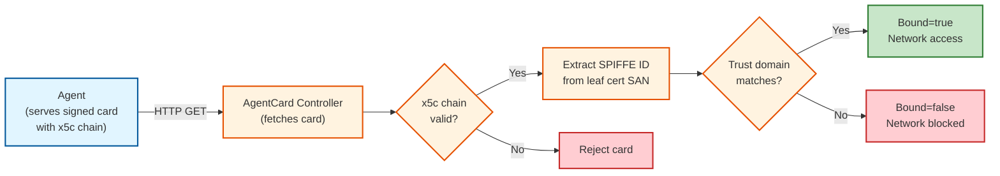

# AgentCard Identity Binding

This guide explains how AgentCards are bound to workload identities using SPIRE-issued X.509-SVIDs. Identity binding ensures that only agents running in the expected trust domain can have their AgentCards accepted.

---

## Overview

| Without Identity Binding | With Identity Binding |
|--------------------------|----------------------|
| Any agent with a valid signature is accepted | Only agents whose SPIFFE ID belongs to the configured trust domain are accepted |

Identity binding uses **trust-domain validation**: the SPIFFE ID extracted from the leaf certificate's SAN URI must belong to the configured trust domain. This is cryptographically enforced -- the SPIFFE ID comes from the x5c certificate chain, not from a self-asserted header claim.

---

## How It Works



1. The init-container signs the AgentCard using the workload's X.509-SVID
2. The operator's X5CProvider validates the `x5c` certificate chain against the SPIRE trust bundle
3. The SPIFFE ID is extracted from the leaf certificate's SAN URI
4. The SPIFFE ID's trust domain is checked against the configured trust domain
5. Both signature AND binding must pass for the `signature-verified=true` label
6. NetworkPolicy enforcement uses this label for traffic control

---

## Configuration

### Operator-Level Trust Domain

Set the default trust domain for all AgentCards:

```bash
--spire-trust-domain=example.org
```

### Per-AgentCard Override

Override the trust domain for a specific AgentCard:

```yaml
apiVersion: agent.kagenti.dev/v1alpha1
kind: AgentCard
metadata:
  name: weather-agent-card
spec:
  targetRef:
    apiVersion: apps/v1
    kind: Deployment
    name: weather-agent
  identityBinding:
    trustDomain: partner.example.com   # Override operator default
    strict: true                        # Reserved for future audit/enforce distinction
```

If `trustDomain` is omitted, the operator-level `--spire-trust-domain` is used.

### Enforcement Behavior

When identity binding is configured, binding failures **always** remove the `signature-verified` label from the workload and trigger a restrictive NetworkPolicy (when `--enforce-network-policies=true`). The `strict` field is reserved for future use.

**Production recommendation:** Always set `strict: true` and `--enforce-network-policies=true`.

---

## Status Fields

| Field | Description |
|-------|-------------|
| `status.validSignature` | `true` if JWS signature verified via x5c chain |
| `status.signatureSpiffeId` | SPIFFE ID extracted from the leaf certificate SAN |
| `status.signatureIdentityMatch` | `true` when both signature AND binding pass |
| `status.bindingStatus.bound` | `true` if trust domain matches |
| `status.bindingStatus.reason` | `Bound`, `NotBound` |
| `conditions[type=SignatureVerified]` | `True`/`False` with reason |
| `conditions[type=Bound]` | `True`/`False` with binding result |

---

## Troubleshooting

| Issue | Cause | Fix |
|-------|-------|-----|
| `bindingStatus.bound: false` with trust domain mismatch | SVID issued by a different trust domain | Verify `--spire-trust-domain` matches the SPIRE server's trust domain |
| `bindingStatus` is nil | No `identityBinding` configured | Add `spec.identityBinding` to the AgentCard |
| `signatureIdentityMatch: false` | Signature valid but binding failed | Check trust domain configuration |
| No NetworkPolicy created | `--enforce-network-policies` not set | Enable network policy enforcement |

```bash
# Debug commands
kubectl get agentcard <name> -o jsonpath='{.status.bindingStatus}' | jq .
kubectl get agentcard <name> -o jsonpath='{.status.signatureSpiffeId}'
kubectl logs -n agentcard-system deployment/agentcard-operator | grep -i binding
kubectl get networkpolicy -n <namespace>
```
