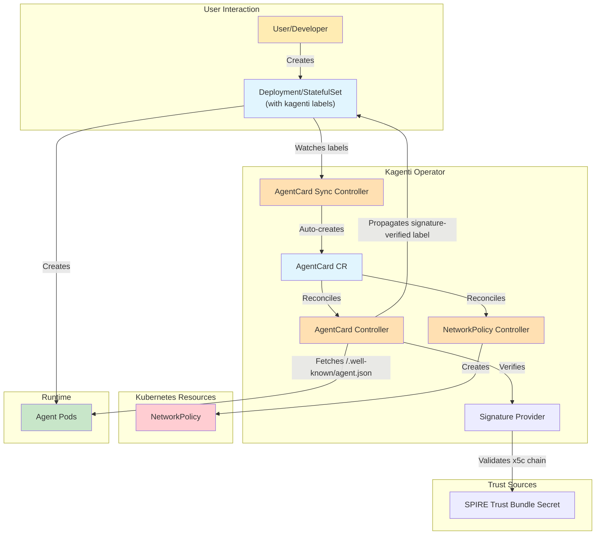

# Architecture

This document provides a detailed overview of the Kagenti Operator architecture, including its components, workflows, and design principles.

## Table of Contents

- [Overview](#overview)
- [Core Components](#core-components)
- [Architecture Diagram](#architecture-diagram)
- [Controller Architecture](#controller-architecture)
- [Security Architecture](#security-architecture)
- [Reconciliation Loops](#reconciliation-loops)
- [Deployment Modes](#deployment-modes)

---

## Overview

The Kagenti Operator is a Kubernetes controller that implements the [Operator Pattern](https://kubernetes.io/docs/concepts/extend-kubernetes/operator/) to automate the discovery, verification, and security of AI agents. Agents are deployed as standard Kubernetes **Deployments** or **StatefulSets** with the `kagenti.io/type: agent` label — the operator automatically discovers labeled workloads and manages their AgentCard lifecycle.

> **Deprecation Notice:** The `Agent` Custom Resource is deprecated and will be removed in a future release. Use standard Kubernetes Deployments or StatefulSets with the `kagenti.io/type: agent` label instead. See the [Migration Guide](../../docs/migration/migrate-agent-crd-to-workloads.md) for details.

### Design Goals

- **Kubernetes-Native Discovery**: Automatic agent discovery through standard Kubernetes resources
- **Security by Default**: Cryptographic signature verification and identity binding for agent cards
- **Flexible Deployment**: Support standard Kubernetes Deployments and StatefulSets as agent workloads
- **Extensibility**: Duck typing with `targetRef` supports any workload type
- **Separation of Concerns**: Discovery, verification, and network policy are handled by independent controllers
- **Cloud-Native**: Leverages native Kubernetes primitives and patterns

---

## Core Components

### Custom Resource Definitions (CRDs)

#### Agent CRD (Deprecated)
> **Deprecated:** Use standard Kubernetes Deployments or StatefulSets with the `kagenti.io/type: agent` label instead.

- Defines desired state of an AI agent deployment
- Manages Kubernetes Deployment and Service resources
- Supports pre-built container images
- Provides status feedback on deployment health

#### AgentCard CRD
- Stores cached agent card metadata fetched from running agents
- References backing workloads via `targetRef` (duck typing)
- Supports signature verification and identity binding configuration
- Enables Kubernetes-native agent discovery via `kubectl get agentcards`

### Controllers

#### Agent Controller (Deprecated)
> **Deprecated:** The Agent CR and its controller are deprecated. Use standard Kubernetes Deployments or StatefulSets with the `kagenti.io/type: agent` label instead.

- Watches Agent resources
- Creates and manages Deployments and Services
- Updates status conditions based on deployment state
- Handles resource cleanup on deletion via finalizers

#### AgentCard Controller
- Watches AgentCard resources
- Resolves the backing workload via `targetRef` (Deployment, StatefulSet, or any workload type)
- Fetches agent card data from the workload's `/.well-known/agent.json` endpoint
- Verifies JWS signatures when signature verification is enabled
- Evaluates SPIFFE identity binding when configured
- Propagates `signature-verified` labels to workload pod templates
- Updates AgentCard status with card data, sync time, and verification results

#### AgentCard Sync Controller
- Watches Deployments and StatefulSets with `kagenti.io/type=agent` labels
- Automatically creates AgentCard resources for discovered agent workloads
- Sets owner references for automatic garbage collection
- Skips Deployments owned by the Agent CRD (those are handled by the Agent path)
- Uses a grace period to avoid duplicate cards when resources are applied together

#### AgentCard NetworkPolicy Controller
- Watches AgentCard resources when `--enforce-network-policies` is enabled
- Creates **permissive** NetworkPolicies for agents with verified signatures (and binding, if configured)
- Creates **restrictive** NetworkPolicies for agents that fail verification
- Resolves pod selectors from the backing workload's pod template labels

### Supporting Components

#### Webhook
- Validates AgentCard resources
- Prevents invalid configurations

#### RBAC Manager
- Creates ServiceAccounts for agents deployed via Agent CRD (deprecated path)
- Manages Roles and RoleBindings
- Implements least-privilege access control

#### Signature Providers
- **X5CProvider**: Validates `x5c` certificate chains against the SPIRE X.509 trust bundle and verifies JWS signatures using the leaf public key

---

## Architecture Diagram



---

## Controller Architecture

### AgentCard Controller

The AgentCard Controller fetches, verifies, and caches agent metadata from running workloads.
> **Deprecated:** The Agent CR and its controller are deprecated. Use standard Kubernetes Deployments or StatefulSets with the `kagenti.io/type: agent` label instead.


### AgentCard Sync Controller

The AgentCard Sync Controller automatically discovers agent workloads and creates AgentCard resources.

#### Reconciliation Flow

```
1. Watch Deployments and StatefulSets with kagenti.io/type=agent label
2. Skip Deployments owned by Agent CRD (those are handled separately)
3. Check for existing AgentCard targeting this workload
4. Apply grace period for newly created workloads (avoids duplicates)
5. Create AgentCard with targetRef pointing to the workload
6. Set owner reference for garbage collection
```

#### AgentCard Naming Convention

```
<workload-name>-<workload-kind-lowercase>-card
```

Examples:
- Deployment `weather-agent` → AgentCard `weather-agent-deployment-card`
- StatefulSet `weather-agent` → AgentCard `weather-agent-statefulset-card`

### NetworkPolicy Controller

The NetworkPolicy Controller enforces network isolation based on signature verification.

#### Reconciliation Flow

```
1. Watch AgentCard resources (when --enforce-network-policies is enabled)
2. Resolve the workload and pod selector labels
3. Determine verification status:
   a. If identity binding configured: both signature AND binding must pass
   b. Otherwise: signature verification alone
4. Create permissive or restrictive NetworkPolicy
5. Clean up NetworkPolicy on AgentCard deletion
```

#### Policy Types

| Status | Policy | Effect |
|--------|--------|--------|
| Verified | Permissive | Allows traffic from/to other verified agents |
| Unverified | Restrictive | Blocks all traffic except DNS and operator |

---

## Security Architecture

### Signature Verification

The operator verifies JWS signatures embedded in agent cards per A2A spec section 8.4:

1. Extract `x5c` certificate chain from JWS protected header
2. Validate the chain against the SPIRE X.509 trust bundle
3. Extract the SPIFFE ID from the leaf certificate's SAN URI
4. Extract the leaf public key and verify the JWS signature (reject `none`, verify key type matches `alg`)
5. Create canonical JSON payload (sorted keys, no whitespace, `signatures` field excluded)
6. Reconstruct signing input: `BASE64URL(protected) || '.' || BASE64URL(canonical_payload)`
7. Verify the cryptographic signature against the leaf public key

Supported algorithms: RS256, RS384, RS512, ES256, ES384, ES512.

### Identity Binding

When `spec.identityBinding` is configured on an AgentCard:

1. The SPIFFE ID is extracted from the leaf certificate's SAN URI (proven by the x5c chain, not self-asserted)
2. The SPIFFE ID's trust domain is validated against the configured trust domain (`spec.identityBinding.trustDomain` or `--spire-trust-domain`)
3. Both signature AND binding must pass for the `signature-verified=true` label
4. NetworkPolicy enforcement uses this label for traffic control

### RBAC

The operator implements least-privilege access control:

#### Operator Permissions
- Read/Write: Agent, AgentCard CRs and their status/finalizers
- Read/Write: Deployments, Services, ServiceAccounts
- Read/Write: Roles, RoleBindings
- Read/Write: NetworkPolicies (when enforcement enabled)
- Read: ConfigMaps, Secrets, Pods
- Create: Events

#### Agent Permissions (per ServiceAccount)
- Minimal runtime permissions
- Read access to required ConfigMaps and Secrets
- No cluster-wide permissions

---

## Reconciliation Loops

### AgentCard Reconciliation

```go
func (r *AgentCardReconciler) Reconcile(ctx context.Context, req Request) (Result, error) {
    // 1. Fetch AgentCard
    agentCard := &AgentCard{}
    if err := r.Get(ctx, req.NamespacedName, agentCard); err != nil {
        return Result{}, client.IgnoreNotFound(err)
    }

    // 2. Resolve workload via targetRef (duck typing)
    workload, err := r.getWorkload(ctx, agentCard)

    // 3. Check workload readiness
    if !workload.Ready { ... }

    // 4. Get protocol and fetch agent card
    card, err := r.AgentFetcher.Fetch(ctx, protocol, serviceURL)

    // 5. Verify signature (if enabled)
    if r.RequireSignature {
        result, err := r.verifySignature(ctx, cardData)
    }

    // 6. Evaluate identity binding (if configured)
    if agentCard.Spec.IdentityBinding != nil {
        binding := r.computeBinding(agentCard, verifiedSpiffeID)
    }

    // 7. Update status and propagate labels
    r.updateAgentCardStatus(ctx, agentCard, ...)
    r.propagateSignatureLabel(ctx, workload, isVerified)

    return Result{RequeueAfter: syncPeriod}, nil
}
```

---

## Deployment Modes

### Cluster-Wide Mode

- Operator watches all namespaces
- Uses ClusterRole and ClusterRoleBinding
- Suitable for platform teams
- Single operator instance manages entire cluster

### Namespaced Mode

- Operator watches specific namespaces (via `NAMESPACES2WATCH` env var)
- Uses Role and RoleBinding per namespace
- Suitable for multi-tenant environments

---

## Performance and Scalability

### Resource Management

- Controllers use efficient caching (controller-runtime informers)
- Field indexers for fast AgentCard lookups by targetRef name
- Reconciliation includes backoff for transient errors
- Status updates use optimistic locking with retry

### Scaling Considerations

| Component | Scaling Strategy |
|-----------|------------------|
| Operator | Single replica (leader election optional) |
| Agents | Horizontal scaling via replicas field |
| AgentCards | One per agent workload |
| NetworkPolicies | One per AgentCard (when enforcement enabled) |

### Monitoring

The operator exposes metrics via Prometheus:

- Reconciliation duration and error rates
- Signature verification counters, duration, and errors (`a2a_signature_verification_*`)

---

## Additional Resources

- [API Reference](./api-reference.md) — CRD specifications
- [Dynamic Agent Discovery](./dynamic-agent-discovery.md) — AgentCard discovery system
- [Signature Verification](./a2a-signature-verification.md) — JWS signature setup guide
- [Identity Binding](./identity-binding-quickstart.md) — SPIFFE identity binding guide
- [Developer Guide](./dev.md) — Contributing to the operator
- [Getting Started](../GETTING_STARTED.md) — Tutorials and examples
