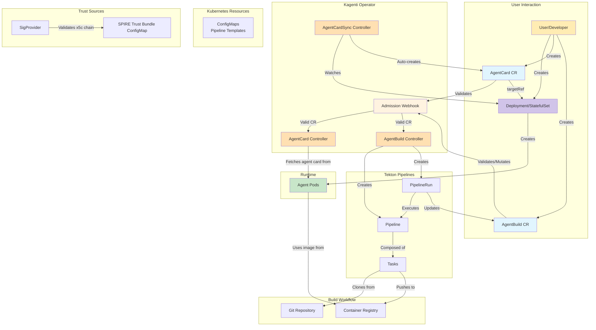
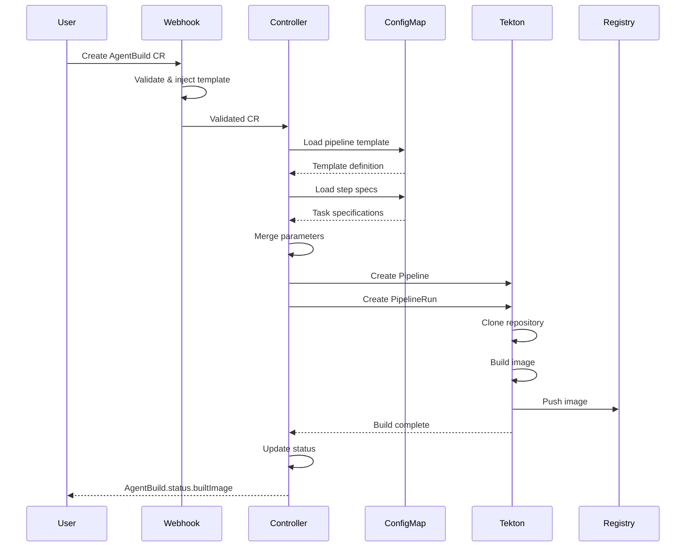

# Architecture

This document provides a detailed overview of the Kagenti Operator architecture, including its components, workflows, and design principles.

## Table of Contents

- [Overview](#overview)
- [Core Components](#core-components)
- [Architecture Diagram](#architecture-diagram)
- [Controller Architecture](#controller-architecture)
- [Security Architecture](#security-architecture)
- [Reconciliation Loops](#reconciliation-loops)
- [Deployment Modes](#deployment-modes)

---

## Overview

The Kagenti Operator is a Kubernetes controller that implements the [Operator Pattern](https://kubernetes.io/docs/concepts/extend-kubernetes/operator/) to automate the discovery and lifecycle management of AI agents. It follows a **Deployment-first model**: users create standard Kubernetes Deployments or StatefulSets, and the operator discovers them via `AgentCard` CRs with `targetRef`. The `AgentBuild` CR handles building container images from source using Tekton pipelines.

### Design Goals

- **Deployment-First**: Users create standard Kubernetes workloads; the operator handles discovery
- **Declarative Configuration**: Infrastructure as Code using Kubernetes CRDs
- **Extensibility**: Template-based build system supporting custom pipelines
- **Security**: Signature verification, identity binding, RBAC, and least-privilege principles
- **Scalability**: Supports multiple agents and builds concurrently
- **Cloud-Native**: Leverages native Kubernetes primitives and patterns

---

## Core Components

### Custom Resource Definitions (CRDs)

#### AgentCard CRD
- Provides dynamic discovery of AI agents via `targetRef`-based workload binding
- Fetches and caches agent metadata (A2A agent cards) from running workloads
- Supports signature verification and identity binding
- Stores agent capabilities, skills, and endpoint information

#### AgentBuild CRD
- Manages container image build pipelines using Tekton
- Supports multiple build modes (dev, buildpack, custom, etc.)
- Tracks build status and outputs built image references

### Controllers

#### AgentCard Controller
- Watches AgentCard resources
- Resolves workloads via `targetRef` (Deployments, StatefulSets)
- Fetches agent cards from running workloads
- Verifies signatures and evaluates identity bindings
- Updates status with cached card data and conditions

#### AgentCardSync Controller
- Watches Deployments and StatefulSets with agent labels
- Automatically creates AgentCard resources for discovered workloads
- Sets owner references for garbage collection

#### AgentBuild Controller
- Watches AgentBuild resources
- Creates and manages Tekton Pipelines and PipelineRuns
- Tracks build status and updates AgentBuild status

#### AgentCard NetworkPolicy Controller
- Watches AgentCard resources when `--enforce-network-policies` is enabled
- Creates **permissive** NetworkPolicies for agents with verified signatures (and binding, if configured)
- Creates **restrictive** NetworkPolicies for agents that fail verification
- Resolves pod selectors from the backing workload's pod template labels

### Supporting Components

#### Webhook
- Validates AgentCard and AgentBuild resources
- Ensures `targetRef` is set on AgentCards
- Mutates resources with default values
- Injects pipeline templates based on mode

#### Signature Providers
- **X5CProvider**: Validates `x5c` certificate chains against the SPIRE X.509 trust bundle and verifies JWS signatures using the leaf public key

---

## Architecture Diagram



---

## Controller Architecture

### AgentCard Controller

The AgentCard Controller reconciles AgentCard CRs by resolving the backing workload via `targetRef`, fetching the agent card from the running agent, and storing the result in status.

#### Reconciliation Flow

```
1. Watch for AgentCard CR changes
2. Resolve workload via spec.targetRef (Deployment or StatefulSet)
3. Construct service URL for the agent
4. Fetch agent card from /.well-known/agent.json
5. Optionally verify signature (if --require-a2a-signature)
6. Evaluate identity binding (if spec.identityBinding configured)
7. Update AgentCard status:
   a. Store cached card data
   b. Set sync conditions
   c. Record signature verification result
8. Requeue after syncPeriod for next fetch
```

#### AgentCard Naming Convention

The controller maintains several conditions:

| Condition | Meaning |
|-----------|---------|
| `Synced` | Agent card fetched successfully from the workload |
| `Ready` | Agent card is available for discovery queries |

Examples:
- Deployment `weather-agent` -> AgentCard `weather-agent-deployment-card`
- StatefulSet `weather-agent` -> AgentCard `weather-agent-statefulset-card`

### NetworkPolicy Controller

The NetworkPolicy Controller enforces network isolation based on signature verification.

#### Reconciliation Flow

```
1. Watch AgentCard resources (when --enforce-network-policies is enabled)
2. Resolve the workload and pod selector labels
3. Determine verification status:
   a. If identity binding configured: both signature AND binding must pass
   b. Otherwise: signature verification alone
4. Create permissive or restrictive NetworkPolicy
5. Clean up NetworkPolicy on AgentCard deletion
```

#### Policy Types

| Status | Policy | Effect |
|--------|--------|--------|
| Verified | Permissive | Allows traffic from/to other verified agents |
| Unverified | Restrictive | Blocks all traffic except DNS and operator |

---

## Security Architecture

### Signature Verification

The operator verifies JWS signatures embedded in agent cards per A2A spec section 8.4:

1. Extract `x5c` certificate chain from JWS protected header
2. Validate the chain against the SPIRE X.509 trust bundle
3. Extract the SPIFFE ID from the leaf certificate's SAN URI
4. Extract the leaf public key and verify the JWS signature (reject `none`, verify key type matches `alg`)
5. Create canonical JSON payload (sorted keys, no whitespace, `signatures` field excluded)
6. Reconstruct signing input: `BASE64URL(protected) || '.' || BASE64URL(canonical_payload)`
7. Verify the cryptographic signature against the leaf public key

Supported algorithms: RS256, RS384, RS512, ES256, ES384, ES512.

### Identity Binding

When `spec.identityBinding` is configured on an AgentCard:

1. The SPIFFE ID is extracted from the leaf certificate's SAN URI (proven by the x5c chain, not self-asserted)
2. The SPIFFE ID's trust domain is validated against the configured trust domain (`spec.identityBinding.trustDomain` or `--spire-trust-domain`)
3. Both signature AND binding must pass for the `signature-verified=true` label
4. NetworkPolicy enforcement uses this label for traffic control

---

## AgentBuild Pipeline Architecture

```
ConfigMap (step-<name>)
└── task-spec.yaml: Complete Tekton TaskSpec
    ├── params: step parameters
    ├── workspaces: required workspaces
    └── steps: container commands
```

### Build Modes

| Mode | Description | Use Case |
|------|-------------|----------|
| `dev` | Basic build with Dockerfile | Development with internal registry |
| `buildpack-dev` | Cloud Native Buildpacks | Development without Dockerfile |
| `dev-external` | Basic build, external registry | Development with external registry |
| `preprod` | Adds security scanning | Pre-production validation |
| `prod` | Full compliance checks | Production deployments |
| `custom` | User-defined steps | Advanced customization |

### Parameter Resolution

Parameters are resolved in this order (highest to lowest priority):

1. User-provided parameters in AgentBuild CR
2. Step-specific parameters
3. Global template parameters
4. Step default parameters

```yaml
# User provides minimal config
parameters:
  - name: SOURCE_REPO_URL
    value: "github.com/myorg/myapp"

# System merges with defaults
# Final pipeline gets:
#   SOURCE_REPO_URL: "github.com/myorg/myapp" (user)
#   SOURCE_REVISION: "main" (template default)
#   BUILD_CONTEXT: "." (step default)
```

### Build Execution Flow



---

## Reconciliation Loops

### AgentBuild Reconciliation

```go
func (r *AgentBuildReconciler) Reconcile(ctx context.Context, req Request) (Result, error) {
    // 1. Fetch AgentBuild
    build := &AgentBuild{}
    if err := r.Get(ctx, req.NamespacedName, build); err != nil {
        return Result{}, client.IgnoreNotFound(err)
    }

    // 2. Check if already complete
    if build.Status.Phase == PhaseSucceeded || build.Status.Phase == PhaseFailed {
        return Result{}, nil
    }

    // 3. Load pipeline template
    template, err := r.loadTemplate(ctx, build.Spec.Mode)
    if err != nil {
        return Result{}, err
    }

    // 4. Create Pipeline
    pipeline, err := r.createPipeline(ctx, build, template)
    if err != nil {
        return Result{}, err
    }

    // 5. Create PipelineRun
    pipelineRun, err := r.createPipelineRun(ctx, build, pipeline)
    if err != nil {
        return Result{}, err
    }

    // 6. Watch PipelineRun status
    if err := r.updateBuildStatus(ctx, build, pipelineRun); err != nil {
        return Result{}, err
    }

    return Result{RequeueAfter: 30*time.Second}, nil
}
```

---

## Security Model

### RBAC

The operator implements least-privilege access control:

#### Operator Permissions
- Read/Write: AgentCard, AgentBuild CRs
- Read: Deployments, StatefulSets, Services, Pods
- Read: ConfigMaps, Secrets
- Create: Events

### Secret Management

## Reconciliation Loops

### AgentCard Reconciliation

```go
func (r *AgentCardReconciler) Reconcile(ctx context.Context, req Request) (Result, error) {
    // 1. Fetch AgentCard
    agentCard := &AgentCard{}
    if err := r.Get(ctx, req.NamespacedName, agentCard); err != nil {
        return Result{}, client.IgnoreNotFound(err)
    }

    // 2. Resolve workload via targetRef (duck typing)
    workload, err := r.getWorkload(ctx, agentCard)

    // 3. Check workload readiness
    if !workload.Ready { ... }

    // 4. Get protocol and fetch agent card
    card, err := r.AgentFetcher.Fetch(ctx, protocol, serviceURL)

    // 5. Verify signature (if enabled)
    if r.RequireSignature {
        result, err := r.verifySignature(ctx, cardData)
    }

    // 6. Evaluate identity binding (if configured)
    if agentCard.Spec.IdentityBinding != nil {
        binding := r.computeBinding(agentCard, verifiedSpiffeID)
    }

    // 7. Update status and propagate labels
    r.updateAgentCardStatus(ctx, agentCard, ...)
    r.propagateSignatureLabel(ctx, workload, isVerified)

    return Result{RequeueAfter: syncPeriod}, nil
}
```

---

## Deployment Modes

### Cluster-Wide Mode

- Operator watches all namespaces
- Uses ClusterRole and ClusterRoleBinding
- Suitable for platform teams
- Single operator instance manages entire cluster

```yaml
apiVersion: rbac.authorization.k8s.io/v1
kind: ClusterRole
metadata:
  name: kagenti-operator-manager-role
rules:
  - apiGroups: ["agent.kagenti.dev"]
    resources: ["agentcards", "agentbuilds"]
    verbs: ["*"]
```

### Namespaced Mode

- Operator watches specific namespaces (via `NAMESPACES2WATCH` env var)
- Uses Role and RoleBinding per namespace
- Suitable for multi-tenant environments
- Multiple operator instances possible

```yaml
apiVersion: rbac.authorization.k8s.io/v1
kind: Role
metadata:
  name: kagenti-operator-manager-role
  namespace: team1
rules:
  - apiGroups: ["agent.kagenti.dev"]
    resources: ["agentcards", "agentbuilds"]
    verbs: ["*"]
```

---

## Performance and Scalability

### Resource Management

- Controllers use efficient caching (controller-runtime informers)
- Field indexers for fast AgentCard lookups by targetRef name
- Reconciliation includes backoff for transient errors
- Status updates use optimistic locking with retry

### Scaling Considerations

| Component | Scaling Strategy |
|-----------|------------------|
| Operator | Single replica (leader election optional) |
| Agents | Horizontal scaling via replicas field |
| AgentCards | One per agent workload |
| NetworkPolicies | One per AgentCard (when enforcement enabled) |

### Monitoring

The operator exposes metrics via Prometheus:

- Reconciliation duration and error rates
- Signature verification counters, duration, and errors (`a2a_signature_verification_*`)

---

## Additional Resources

- [API Reference](./api-reference.md) — CRD specifications
- [Dynamic Agent Discovery](./dynamic-agent-discovery.md) — AgentCard discovery system
- [Signature Verification](./agentcard-signature-verification.md) — JWS signature setup guide
- [Identity Binding](./agentcard-identity-binding.md) — SPIFFE identity binding guide
- [Developer Guide](./dev.md) — Contributing to the operator
- [Getting Started](../GETTING_STARTED.md) — Tutorials and examples
