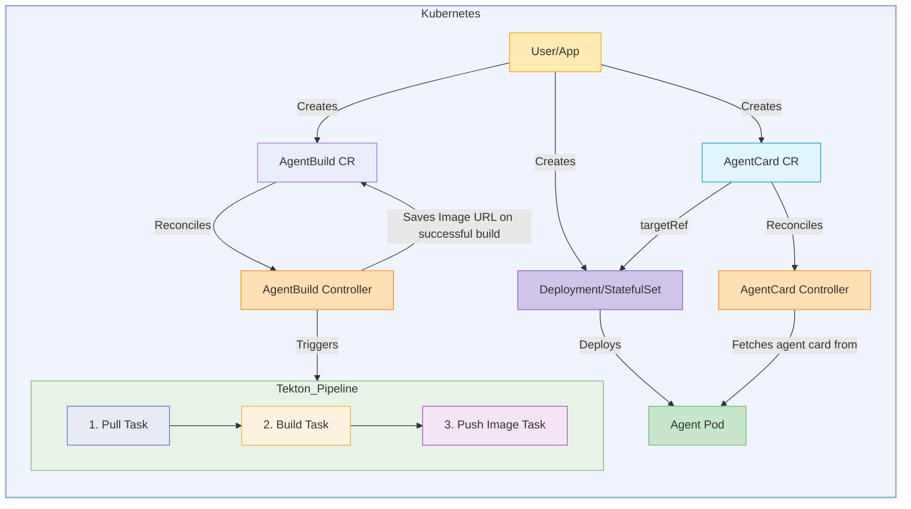

# Kagenti Operator

This document presents a proposal for a Kubernetes Operator to automate the lifecycle management of AI agents within a Kubernetes cluster. The operator follows a **Deployment-first model**: users create standard Kubernetes Deployments or StatefulSets for their agents, and the operator discovers them via `AgentCard` Custom Resources with `targetRef`. The `AgentBuild` CR handles building container images from source.

The `AgentCard` CR provides dynamic agent discovery by fetching and caching agent metadata (e.g., A2A agent cards) from running workloads. Each AgentCard references a backing workload via `spec.targetRef`.

The `AgentBuild` CR defines the specifications for building and publishing a container image for an AI agent. Upon creation or update of an `AgentBuild` resource, the operator will trigger a Tekton pipeline to automate pulling source code, building a Docker image, and pushing it to a specified image registry. Secure access to private repositories is managed through a reference to a Kubernetes Secret containing a GitHub token.

## Goals

* Follow a Deployment-first model where users create standard Kubernetes Deployments/StatefulSets for their agents
* Provide dynamic agent discovery through `AgentCard` CRs with `targetRef`-based workload binding
* Provide cryptographic signature verification for agent cards (JWS with RSA/ECDSA via x5c certificate chains)
* Support SPIFFE-based workload identity binding with trust-domain validation
* Enforce network isolation via Kubernetes NetworkPolicies based on verification status
* Automate the container image building and publishing process for AI agents triggered by `AgentBuild` CRs
* Integrate with Tekton Pipelines for the image building workflow, consisting of pull, build, and push tasks
* Securely manage GitHub repository access using a referenced Kubernetes Secret
* Support cluster-wide as well as namespaced scope deployment

## Deployment Modes

The kagenti operator supports both cluster-wide and namespaced deployment modes. In cluster-wide mode, it uses ClusterRoleBinding to watch and reconcile resources across all namespaces. For stricter isolation, it can run in namespaced scope using the `NAMESPACES2WATCH` environment variable, allowing the operator to only manage resources in explicitly authorized namespaces while maintaining least-privilege access controls.

## Architecture



## Controllers

The operator runs the following controllers:

### AgentCard Controller
Reconciles `AgentCard` CRs by resolving the backing workload via `spec.targetRef` (duck typing), fetching the agent card from the workload's `/.well-known/agent.json` endpoint, verifying JWS signatures, evaluating SPIFFE identity binding, and updating the AgentCard status.

### AgentCard Sync Controller
Watches Deployments and StatefulSets labeled with `kagenti.io/type=agent` and one or more `protocol.kagenti.io/<name>` labels (e.g., `protocol.kagenti.io/a2a`). Automatically creates AgentCard resources with `targetRef` pointing to the discovered workloads. Sets owner references for garbage collection.

### AgentBuild Controller
Reconciles `AgentBuild` CRs by creating and managing Tekton Pipelines and PipelineRuns. Tracks build status and updates AgentBuild status with the built image reference.

### NetworkPolicy Controller
Watches AgentCard resources when `--enforce-network-policies` is enabled. Creates permissive NetworkPolicies for agents with verified signatures and restrictive NetworkPolicies for unverified agents. When identity binding is configured, both signature and binding must pass for permissive access.

## Security Features

### Signature Verification
The operator verifies JWS signatures embedded in agent cards per A2A spec section 8.4 using the **X5CProvider**. The `x5c` certificate chain in the JWS protected header is validated against the SPIRE X.509 trust bundle, and the leaf certificate's public key is used for signature verification.

### Identity Binding
AgentCards are bound to workload identities via trust-domain validation. The SPIFFE ID is extracted from the leaf certificate's SAN URI (cryptographically proven by the x5c chain) and validated against the configured trust domain.

### Network Isolation
When `--enforce-network-policies` is enabled, the NetworkPolicy controller creates:
- **Permissive policies** for verified agents (allows traffic to/from other verified agents)
- **Restrictive policies** for unverified agents (blocks all traffic except DNS and operator)

## License

```bash
Copyright 2025.

Licensed under the Apache License, Version 2.0 (the "License");
you may not use this file except in compliance with the License.
You may obtain a copy of the License at

    http://www.apache.org/licenses/LICENSE-2.0

Unless required by applicable law or agreed to in writing, software
distributed under the License is distributed on an "AS IS" BASIS,
WITHOUT WARRANTIES OR CONDITIONS OF ANY KIND, either express or implied.
See the License for the specific language governing permissions and
limitations under the License.

```
