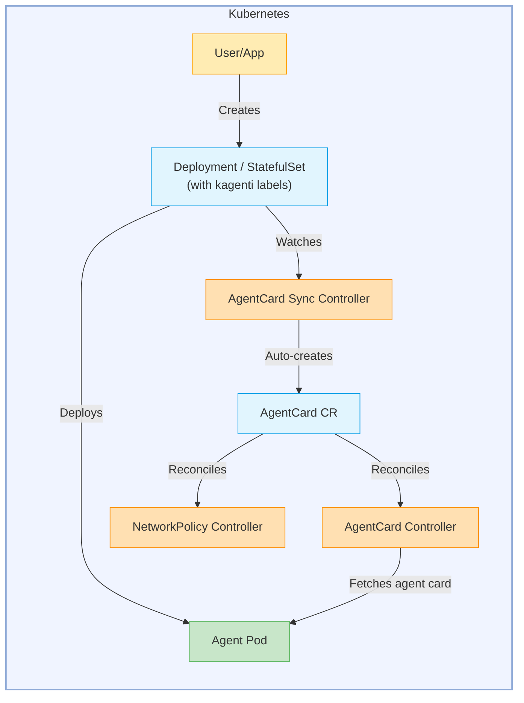

# Kagenti Operator

This document describes the Kagenti Operator, a Kubernetes Operator that automates the deployment, discovery, and security of AI agents within a Kubernetes cluster.

The operator manages the `AgentCard` Custom Resource for agent discovery and verification. Agents are deployed as standard Kubernetes **Deployments** or **StatefulSets** with the `kagenti.io/type: agent` label — the operator automatically discovers labeled workloads and creates AgentCard resources for them.

> **Deprecation Notice:** The `Agent` Custom Resource is deprecated and will be removed in a future release. Use standard Kubernetes Deployments or StatefulSets with the `kagenti.io/type: agent` label instead. See the [Migration Guide](../../docs/migration/migrate-agent-crd-to-workloads.md) for details.

## Goals

* Support deployment of AI agents using standard Kubernetes Deployments and StatefulSets with the `kagenti.io/type: agent` label
* Automatically discover and index agent metadata via the A2A protocol
* Provide cryptographic signature verification for agent cards (JWS with RSA/ECDSA)
* Support SPIFFE-based workload identity binding with allowlist enforcement
* Enforce network isolation via Kubernetes NetworkPolicies based on verification status
* Lock down agent pods with read-only filesystem with minimal privileges
* Support cluster-wide as well as namespaced scope deployment

## Deployment Modes

The kagenti operator supports both cluster-wide and namespaced deployment modes. In cluster-wide mode, it uses ClusterRoleBinding to watch and reconcile resources across all namespaces. For stricter isolation, it can run in namespaced scope using the `NAMESPACES2WATCH` environment variable, allowing the operator to only manage resources in explicitly authorized namespaces while maintaining least-privilege access controls.

## Architecture



## Controllers

The operator runs four controllers:

### Agent Controller (Deprecated)
> **Deprecated:** The Agent CR and its controller are deprecated. Use standard Kubernetes Deployments or StatefulSets with the `kagenti.io/type: agent` label instead.

Reconciles `Agent` CRs into Kubernetes Deployments and Services. Creates RBAC objects (ServiceAccount, Role, RoleBinding) for each agent. Updates the Agent status with deployment phase and conditions.

### AgentCard Controller
Reconciles `AgentCard` CRs by resolving the backing workload via `spec.targetRef` (duck typing), fetching the agent card from the workload's `/.well-known/agent.json` endpoint, verifying JWS signatures, evaluating SPIFFE identity binding, and updating the AgentCard status.

### AgentCard Sync Controller
Watches Deployments and StatefulSets labeled with `kagenti.io/type=agent` and `kagenti.io/protocol=<protocol>`. Automatically creates AgentCard resources with `targetRef` pointing to the discovered workloads. Sets owner references for garbage collection.

### NetworkPolicy Controller
Watches AgentCard resources when `--enforce-network-policies` is enabled. Creates permissive NetworkPolicies for agents with verified signatures and restrictive NetworkPolicies for unverified agents. When identity binding is configured, both signature and binding must pass for permissive access.

## Security Features

### Signature Verification
The operator verifies JWS signatures embedded in agent cards per A2A spec section 8.4. Two providers are supported:
- **Secret Provider**: Reads public keys from Kubernetes Secrets
- **JWKS Provider**: Fetches public keys from a JWKS endpoint (RFC 7517)

### Identity Binding
AgentCards can be configured with `spec.identityBinding.allowedSpiffeIDs` to restrict which workload identities are permitted. The SPIFFE ID is extracted from the JWS protected header during signature verification.

### Network Isolation
When `--enforce-network-policies` is enabled, the NetworkPolicy controller creates:
- **Permissive policies** for verified agents (allows traffic to/from other verified agents)
- **Restrictive policies** for unverified agents (blocks all traffic except DNS and operator)

## License

```bash
Copyright 2025.

Licensed under the Apache License, Version 2.0 (the "License");
you may not use this file except in compliance with the License.
You may obtain a copy of the License at

    http://www.apache.org/licenses/LICENSE-2.0

Unless required by applicable law or agreed to in writing, software
distributed under the License is distributed on an "AS IS" BASIS,
WITHOUT WARRANTIES OR CONDITIONS OF ANY KIND, either express or implied.
See the License for the specific language governing permissions and
limitations under the License.

```
